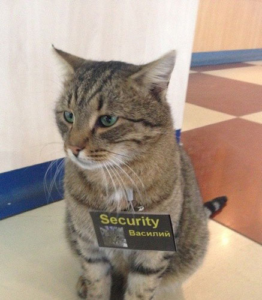

# OAuth в целом

Данный стандарт имеет три воплощения: 1.0, 1.0a и 2.0. Наиболее актуальный и рекомендуемый выпуск - OAuth 2.0.

<i>OAuth</i> (это сокращение от выражения открытая авторизация) представляет собой стандарт авторизации в Интернете на основе токенов. Они сокращают промежуток времени открытости имен пользователей и паролей.

OAuth является протоколом авторизации (отвечая на вопрос "Что разрешено пользователю?"), а не протоколом <i>Аутенфикации</i> (который отвечает на вопрос "Кто этот пользователь?")

OAuth предоставляет клиентам "защищенный делегированный доступ" к сервисам от имени владельца данных, доступных на сервисе. После аутенфикации для авторизации запросов клиенты применяют токены. Для каждого клиента используется свой токен.

### Немного терминологии в OAuth

**<i>Клиент</i>**: приложение, выполняющее защищенные запросы. Зачастую, но не всегда, клиент делает запросы от имени конечного пользователя. Это может быть iPhone или Android приложение, бразуерный клиент HTML5 и даже часы!

**<i>Владелец ресурса</i>**: обычно этот термин относится к конечному пользователю (Куприянов Артур, Колоколов Артем, Кульбако Артемий), который может предоставить клиенту разрешение на доступ к своей информации.

**<i>Сервер ресурса</i>**: сервер, на котором находится защищенный ресурс, способный прнимать защищенные запросы, содержащие токены, и отвечать на них. Этот термин имеет отношение к защищенному API, с которым клиент пытается наладить связь.

**<i>Сервер авторизации</i>**: сервер, выдающий токен доступа клиенту после успешной авторизации.

<h2 align=center></h2>

## Как же все это работает?

Как и говорилось ранее, "OAuth является протоколом авторизации", то есть выясняет, что разрешено клиенту.

Пользователь дает свое разрешение какому-либо приложению действовать от своего имени или предоставляет доступ к
некоторым защищенным ресурсам с помощью токенов.

Токен - это по сути ключ, через который можно проходить к защищенным ресурсам пользователя. Ключ может быть разного уровня
доступа. Так, например, на гитхабе можно разрешить какому-либо приложению дать доступ лишь на чтение репозиториев, тогда как
другим давать возможность их изменять. Способы задания уровней доступа и их реализация полностью лежит на **сервере авторизации**.

Таким образом, с помощью токенов, ваше приложение будет иметь пропуск к вашим ресурсам или ресурсам другого пользователя.

## access и refresh токены
Казалось бы все просто, но зачем тогда нужны и `access_token`, и `refresh_token`?

Давайте сначала определимся: `access_token` - это некий пропуск, с помощью которого приложение может иметь доступ к 
ресурсам (смотреть информацию о пользователе, делать что-то от его имени и тд). Но что будет, если его смогут украсть злоумышленники?

Если этот `access_token` будет работать всегда, то злоумышленники смогут взять полный контроль над нашими данными. Тогда давайте
сделаем так, чтобы этот `access_token` действовал лишь определенное время (скажем, 2 часа). Следовательно, максимальное время, которое получит злоумышленник это 2 часа (можно сделать и меньше).

Но с точки зрения пользователя - это очень неудобно, так как ему бы пришлось заново логиниться каждые два часа. И тут
к нам на помощь приходит `refresh_token`, который позволяет обновить "протухший" (переставший действовать) `access_token`.

Для этого достаточно отправить еще один запрос с `refresh_token`, чтобы получить новую пару токенов доступа и при этом
пользователю уже не надо повтороно аутентифицироваться.

## Что если злоумышленник смог взять сразу два токена?
Можно подумать, что если злоумышленник получит два токена, то он сможет пользоваться ими бесконечно, все время обновляя их.

Но это не совсем так. Дело в том, что когда злоумышленник запросит новые токены, а после этого авторизованное приложение сделает свой запрос, то серверу уже станет известно, что что-то тут не так. И в зависимости от сервера авторизации, пользователя оповестят о том, что
кто-то пытался получить его токены доступа, при этом идентифицировав его.

Таким образом, приложение получит новые токены, а недавно обновленные токены злоумышленника сразу протухнут.
